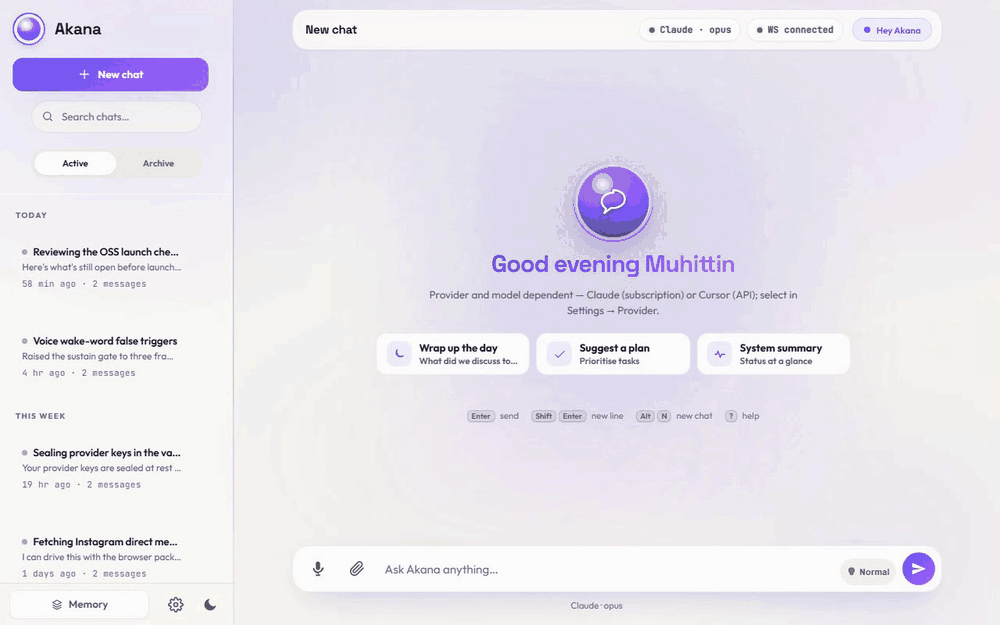
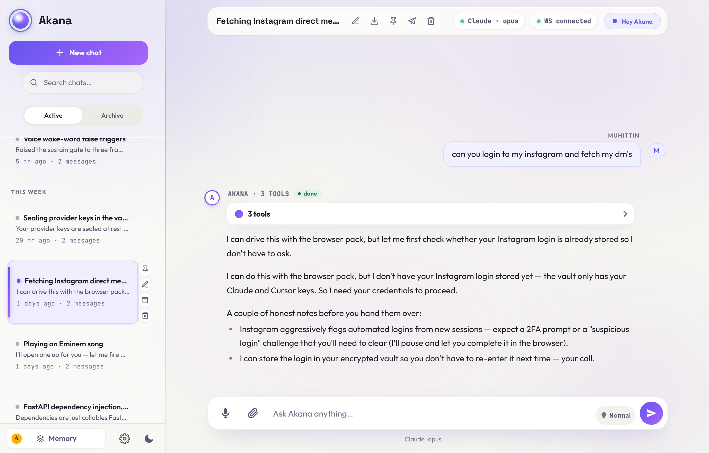
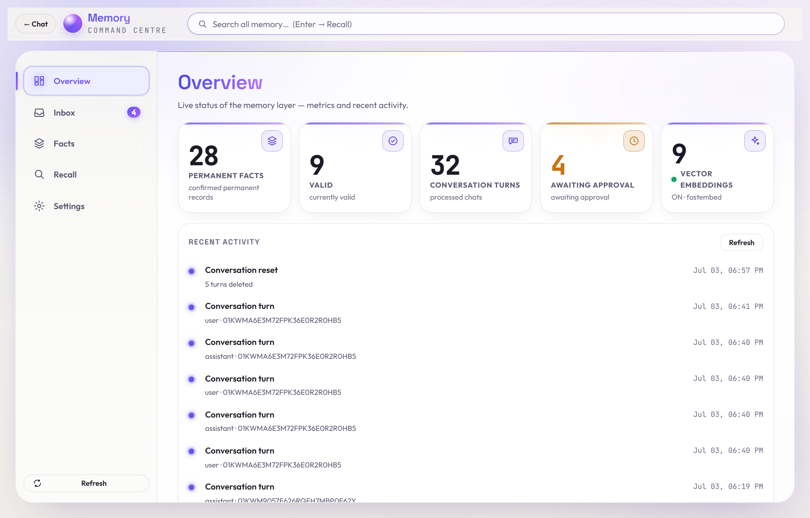
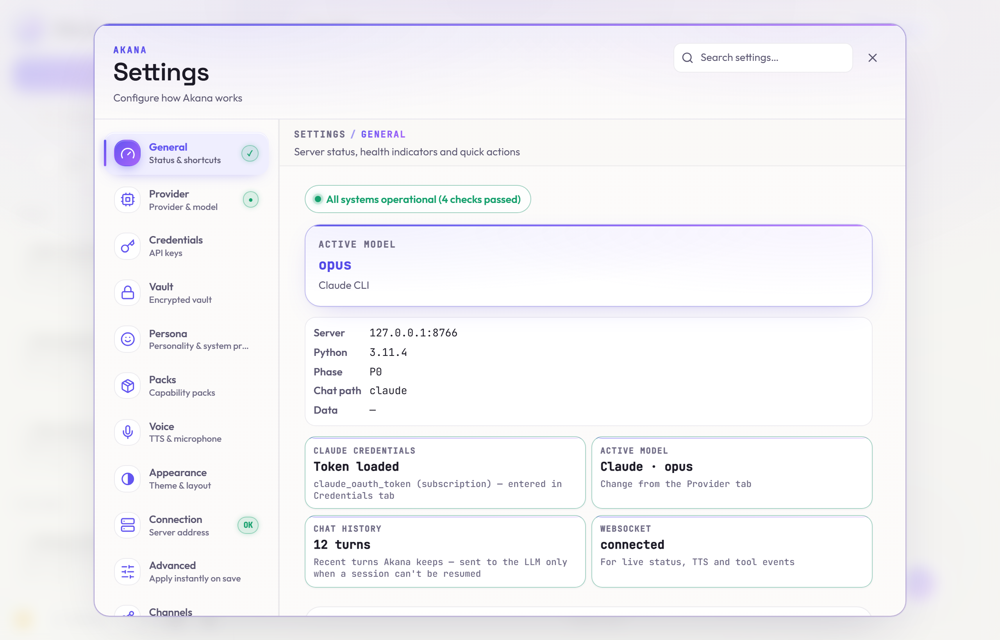
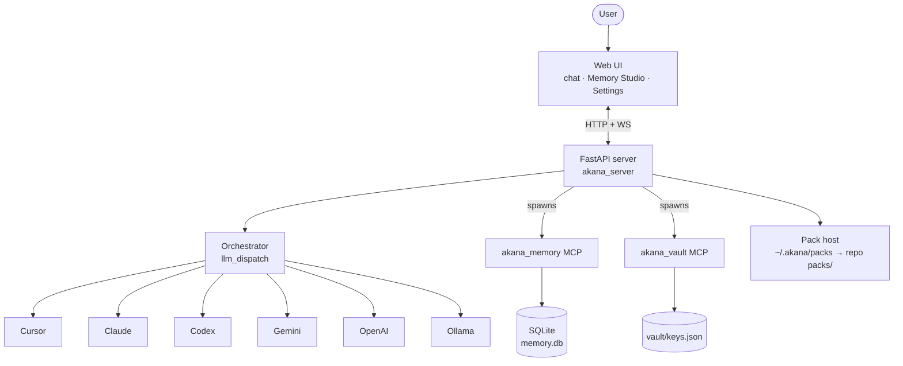

# Akana

<p align="center">
  
</p>

<p align="center">
  <b>A self-hosted assistant that runs on your machine with the model you choose. Memory is approved by you; keys stay encrypted.</b>
</p>

<p align="center">
  A self-hosted AI assistant server: one web UI, six swappable LLM providers, review-gated persistent memory, an encrypted credential vault, custom wake-word voice, reminders and scheduled prompts, plus capability packs for browser and perception-grounded desktop automation. One command backs up and restores your whole data directory. Packs are a plain-directory format, so writing your own is the intended path. Your vault, memory and files stay on your machine; no accounts, no telemetry, no cloud tenancy.
</p>

<p align="center">
  
  
  
</p>

<p align="center">
  
  <br/>
  <sub><em>Recorded from the live app — memory recalled across three tool calls, a real briefing written back.</em></sub>
</p>

> **Where your data lives.** Your vault, memory database and pack storage stay on your machine. Model traffic does not: unless you run Ollama, prompts go to the cloud provider you pick. The **default** voice path is cloud too. `edge-tts` sends synthesized text to Microsoft; browser speech-to-text sends audio to Google. A fully local pipeline is possible (Ollama for inference plus local voice), but it is the **least-tested path**: small local models call tools unreliably. Akana's memory/vault tool-calling is unit-tested but **not validated end-to-end against a real local model**. Treat local inference as experimental. See [Security and privacy](#security-and-privacy).

---

## Contents

- [Quick start](#quick-start)
- [Why Akana](#why-akana)
- [Screenshots](#screenshots)
- [How it works](#how-it-works)
- [Providers](#providers)
- [Memory](#memory)
- [Voice](#voice)
- [Capability Packs](#capability-packs)
- [Remote access & Telegram](#remote-access--telegram)
- [Security and privacy](#security-and-privacy)
- [Configuration](#configuration)
- [CLI reference](#cli-reference)
- [Known limitations](#known-limitations)
- [Development](#development)
- [Contributing, license and attribution](#contributing-license-and-attribution)

---

## Quick start

**Requires Python 3.11+.** Node 18+ is needed for the Cursor and Claude providers and for browser-pack (which runs `@playwright/mcp` via `npx`).

**Linux / macOS:**

```sh
git clone https://github.com/MuhittinYilmazer/akana.git
cd akana
bash install.sh
```

**Windows:**

```
git clone https://github.com/MuhittinYilmazer/akana.git
cd akana
.\install.cmd
```

`install.cmd` is a batch wrapper that invokes `install.ps1` with `-ExecutionPolicy Bypass` for this one process, so a fresh Windows box does not need any policy change. (`powershell -ExecutionPolicy Bypass -File install.ps1` does the same thing.)

The bootstrapper finds a Python 3.11+ interpreter and hands off to `python akana.py setup`. The **setup wizard** creates the virtual environment and installs requirements, then configures providers and voice. It asks you to choose a language (English or Turkish), then walks through providers and voice extras. The bundled "Hey Akana" wake model is on by default; wake on/off is a runtime setting in the UI. Both scripts accept the same flags as `setup` and forward them.

Once setup finishes:

```sh
python akana.py start
```

The server prints its URL (default `http://127.0.0.1:8766`) and the bearer token if one was generated. Open the URL in a browser to reach the chat and Memory Studio panes.

**There is no default provider.** You pick one during setup. The two low-friction paths:

- **Zero API key, fully local:** install [Ollama](https://ollama.com) and point Akana at it, so model inference stays on your machine. This is the least-tested path; the memory/vault tool surface is at full parity with the other providers, but whether the tools actually fire depends on the local model's own function-calling ability. See [Providers](#providers).
- **Simplest hosted:** the **Claude** provider authenticates through the Claude Code CLI. Either log in interactively with `claude`, or generate a token with `claude setup-token` and paste it in Settings → Credentials. There is no per-request API key. This is the most heavily used and tested path.

## Why Akana

- **Memory you approve before it's remembered.** An LLM auto-capture pass and the model's own remember tool both land in a **staging inbox**. Staged items are visible to the assistant (flagged as pending/unapproved in recall), but nothing becomes durable, trusted memory until you approve it in the Memory Studio.
- **Six providers, one UI.** Claude, Cursor, Codex, Gemini, OpenAI and Ollama all run through one dispatch hub and one chat surface. Swap the backend without changing your workflow.
- **Proactive, not just reactive.** Ask for a reminder or a recurring briefing and a schedule engine runs the turn when it's due, delivering to a chat thread and/or Telegram — with an observability panel in Settings showing tokens, per-provider usage, health and the audit trail.
- **Encrypted credential vault.** Provider keys and secrets live in a Fernet-encrypted store, with the master key kept **outside** the data directory (owner-only). Every assistant access to a secret is audit-logged.
- **One-command backup.** `python akana.py backup` snapshots your whole data directory — memory, personas, uploads, settings, encrypted secrets — into a single `.tar.gz` (SQLite via the online backup API; secrets stay ciphertext, the master key is not bundled), and `restore` brings it back.
- **Voice with a committed wake model.** A custom-trained "Hey Akana" openWakeWord model ships in-repo and is the default. A fully local voice path (local wake, local STT, offline Piper TTS) is one install away.
- **Browser and desktop automation.** Opt-in capability packs let the assistant drive a headful Playwright browser or control your live desktop. Desktop control is **perception-grounded** — it reads a structured accessibility tree and clicks elements by reference, not blind pixels (Windows UI Automation / Linux AT-SPI, with a screenshot fallback) — and can require your **per-action approval** (off by default).
- **Bilingual (English / Turkish).** UI, persona prompts, wake word, TTS and STT all follow one language toggle. English is the default everywhere.

## Screenshots

<table>
<tr>
<td align="center"><a href="docs/screenshots/chat.png"></a><br/><sub><b>Chat</b> — persona-aware, tool-calling, memory-injected turns</sub></td>
<td align="center"><a href="docs/screenshots/memory-studio.png"></a><br/><sub><b>Memory Studio</b> — review the inbox, browse facts, walk the timeline</sub></td>
<td align="center"><a href="docs/screenshots/settings.png"></a><br/><sub><b>Settings</b> — providers, models, vault, voice, packs</sub></td>
</tr>
</table>

## How it works

Akana is a FastAPI application (`akana_server/`) that serves both HTTP and WebSocket surfaces from one port, alongside the static web UI (`web_ui/`, no build step). Between the HTTP surface and the providers sits an orchestrator whose single dispatch hub (`llm_dispatch.py`) resolves the configured provider and forwards each turn. Memory and vault are exposed to the model as first-party MCP servers spawned as subprocesses, so the same servers can also be attached to external MCP clients. Packs are discovered from `~/.akana/packs` then the repo's `packs/`.



Full detail (server, orchestrator, vault internals and the data-directory layout) is in **[docs/architecture.md](docs/architecture.md)**.

## Providers

Akana registers six chat providers under a shared dispatch layer. **There is no default:** with nothing configured, chat calls fail with a `No LLM provider configured` error rather than picking one for you. Every provider uses **your own** key or session; foreign-provider keys are stripped from the environment before the Cursor and Claude bridges spawn.

| Provider | Install | Model traffic goes to | Memory / vault reach | Agent reuse | Notes |
| --- | --- | --- | --- | --- | --- |
| **Claude** | Global `@anthropic-ai/claude-code` CLI | Anthropic | Native MCP | Yes (`--resume`) | MCP-native; only provider with auto-continue (off by default). |
| **Cursor** | Node bridge (`add cursor` → `npm install`) | Cursor cloud | Native MCP | Yes (stored `agent_id`, SDK `Agent.resume`) | MCP-native; agent reuse. |
| **Codex** _(beta)_ | Global `@openai/codex` CLI (`add codex`) | OpenAI (ChatGPT plan) | Native MCP | Yes (`exec resume`) | Subscription-billed via `codex login` — no API key; agentic CLI like Claude/Cursor. Untested against a live login yet. |
| **Gemini** _(beta)_ | `add gemini` (`google-genai`) | Google | Full parity (function-calling) + MCP bridge | No | Image + PDF input (inline); thinking on Gemini 3+. |
| **OpenAI** _(beta)_ | None (uses core `httpx`) | OpenAI | Full parity (function-calling) + MCP bridge | No | Image + PDF input (inline); `reasoning_effort` on o-series and GPT-5+. |
| **Ollama** _(beta)_ | External Ollama app | Local Ollama server | Full parity (function-calling) + MCP bridge | No | Fully local, but the **least-tested** path. The tool surface is at parity, but firing depends on the local model's own function-calling ability; small models call unreliably. |

> **Claude and Cursor are the tested path; the other four are beta.** Claude and Cursor each run as their own agent (the `claude` CLI, the Cursor SDK), speak MCP natively, and are what the project is built and used against day to day. **Codex is beta for a different reason:** it is a full agentic CLI bridge like Claude/Cursor (subscription auth via `codex login`, session resume, MCP-native), but it has not yet been exercised against a live login — only against protocol fakes. **Gemini, OpenAI and Ollama are beta:** they are plain chat providers wired for memory/vault and MCP tool-calling, but exercised only by unit tests against *fake* providers. They have **not** been verified against the live Google / OpenAI / Ollama APIs, and they are not agentic coders (a `claude`/Cursor-style agent that reads, writes and runs in your workspace). Treat them as incomplete and expect rough edges; please open an issue if you hit one.

Cursor and Claude speak MCP natively and see the built-in `akana_memory` and `akana_vault` servers plus anything in `mcp_servers.yaml`. Gemini, OpenAI and Ollama get the **same** tools re-declared as native function-calling schemas. The memory operations (search / remember / forget, exposed natively as `memory_search` / `save_memory` / `memory_forget`) and the full seven-tool vault surface are at functional parity with what Claude and Cursor reach over MCP, derived single-source from the same schemas so the two surfaces stay in step. These providers also reach external MCP servers through an in-process bridge, with their tool loop capped at five rounds per turn. This path is exercised by unit tests against fake providers. Tool parity and model capability are separate concerns: on local Ollama models, whether the tools actually fire depends on the model's own function-calling ability and has not been verified end-to-end on real hardware. Smaller models call tools unreliably, so treat native tool use there as experimental.

Per-provider install, credentials, thinking mode and multimodal input, plus the two file-upload mechanisms, are in **[docs/providers.md](docs/providers.md)**.

## Memory

Akana's memory is **review-gated**. Facts are proposed two ways: an LLM auto-capture pass after each turn, or the model calling the remember tool. **Both land in a staging inbox by default.** Staged items are visible to the assistant, flagged as pending/unapproved in recall, but nothing becomes durable, trusted memory until you approve it in the Memory Studio (`web_ui/memory.html`). It has tabs for an overview (including a bilingual timeline), the inbox, the fact list, a recall search, plus memory settings.

Memory lives in one SQLite file (`<data_dir>/db/memory.db`) with an **episodic** layer (raw turns) and a **semantic** layer (durable key/value facts tagged with trust level, validity window and provenance). Recall is keyword-based out of the box; semantic (vector) recall is opt-in via `python akana.py add embeddings` (a ~220 MB CPU-only ONNX model, no torch/GPU) and falls back to keyword search if the embedder is missing.

Storage model, the capture pipeline, vector recall, the event ledger and background summary jobs are covered in **[docs/memory.md](docs/memory.md)**.

## Voice

A custom-trained **"Hey Akana"** openWakeWord ONNX model ships in-repo (`akana_server/voice/wake_models/hey_akana.onnx`) and is the default wake model. Install `python akana.py add voice-full` for local acoustic wake scoring and local (`faster-whisper`) speech-to-text; without it, the browser's `SpeechRecognition` API handles wake and STT (Chromium-only; audio goes to Google).

Text-to-speech ships three engines:

| Engine | Locality | License | Notes |
| --- | --- | --- | --- |
| **edge-tts** | **Online (default)**, text goes to Microsoft | **GPL-3.0** (installed from PyPI; not vendored) | Microsoft neural voices; zero setup. |
| **piper** | **Offline** | MIT | `add voice-piper`. Recommended for local-only / commercial use. |
| **XTTS-v2** | **Offline**, heavy | Model weights **CPML — non-commercial** | `add xtts`. ~2 GB model, GPU-friendly, voice cloning. Not for commercial use. |

> **Why edge-tts is the default:** it needs no download and no local model. It is **online** (synthesized text goes to Microsoft) and **GPL-3.0**. It is installed from PyPI as a runtime dependency and is not vendored, so Akana's own source stays MIT. For an offline or permissive path, install **Piper** (MIT) and select it. See [THIRD_PARTY_LICENSES.md](THIRD_PARTY_LICENSES.md) and [Security and privacy](#security-and-privacy).

Wake tuning, STT options, voice selection, conversation mode, barge-in and the Gemini Live / OpenAI Realtime bridges are in **[docs/voice.md](docs/voice.md)**.

## Capability Packs

Capability Packs bundle skills, personas and MCP tool declarations. Each pack is a directory with a `pack.yaml` manifest and, per skill, a `SKILL.md`. Three ship in-repo:

- **browser-pack** — mounts Microsoft's Playwright MCP (`@playwright/mcp`) as a headful, persistent-profile browser: navigate, snapshot, click, fill, type, screenshot, download.
- **computer-control** — a first-party MCP server for the live desktop. It is **perception-grounded**: `read_screen` returns a structured accessibility tree in which every interactable element ends in a `[ref]`, and `click_ref` / `type_into_ref` act on that reference (Windows UI Automation / Linux AT-SPI), with a screenshot + pixel-coordinate fallback for apps that expose no accessibility layer. Plus mouse click/drag/scroll, type, hotkeys, clipboard, launch app, and window list/focus/move/resize/close. An **opt-in per-action approval** gate (`computer_control_approval`, off by default) can require your confirmation before it acts — `destructive` (app launch, window close, drag) or `all` (every action).
- **pack-author-pack** — an offline meta-pack for scaffolding and validating new packs. No external tools, no MCP server.

### Write your own pack

Packs are the primary extension point. The three bundled packs are examples; the format is meant for writing your own. A pack is a plain directory you place into `packs/`; Akana hot-loads it on the next rescan (no restart). At its simplest it is a `pack.yaml` plus one `skills/<name>/SKILL.md`. To expose tools, it declares an MCP server that mounts only after you approve it (see the consent model below).

- The full producer↔consumer contract (manifest schema, skill format, MCP declaration, consent, plus a `v0.1` enforcement table of what is and isn't wired yet) is in **[packs/PACK_INTERFACE.md](packs/PACK_INTERFACE.md)** (source of truth: `packs/contract/`).
- The bundled **pack-author-pack** gives an assistant the skills to scaffold a new pack, add skills to it and validate it. It is a working example to copy from.

**Installing computer-control's dependencies.** The `computer-control` pack needs extra Python packages that are **not** in core requirements. Before enabling it, install them into the same venv:

```sh
pip install -r requirements-computer.txt
```

(That pulls `pyautogui`, `mss`, `pygetwindow`, `pyperclip`, plus `uiautomation` on Windows for the perception layer. On Linux, perception uses the system AT-SPI bindings — install the distro packages, e.g. `python3-pyatspi gir1.2-atspi-2.0`, and enable accessibility in the desktop; without a perception backend the pixel tools still work.) `browser-pack` instead needs Node: it runs `@playwright/mcp` via `npx`.

**Consent model.** Enabling a pack only registers its skills and persona and probes its declared tools. Mounting an MCP server (writing it into `mcp_servers.yaml` so providers see it) is a separate, bearer-authenticated step (`POST /packs/consent`). It never happens automatically. Revoking (`POST /packs/consent/revoke`) only touches entries stamped with Akana's own `managed_by` marker, so user-authored entries are never overwritten.

> **Permissions are advisory in v0.1.** The `permissions` block in `pack.yaml` (network, sandbox tier, `secure_vault_read`, `file_system`) is metadata; the host does **not** enforce it. Packs run as ordinary child processes with the account's own permissions. **There is no sandbox** around browser-pack or computer-control.

## Remote access & Telegram

**Remote access.** Akana is a personal server, not a cloud service. The supported way to reach it from your phone or tablet is [Tailscale](https://tailscale.com/) Serve on a private tailnet: set `AKANA_TOKEN`, expose the loopback port with `tailscale serve`, then pair the phone by scanning a QR from the desktop cockpit (the QR carries the bearer token in a URL fragment that the phone strips immediately). Voice mode and PWA install require HTTPS, which Tailscale Serve provides. Safety rails: a non-loopback bind with an empty token refuses to start, proxied requests always require the bearer, Funnel (public exposure) is refused without a token.

**Telegram.** An optional bridge lets you reach your local assistant like any other bot. Create a bot with [@BotFather](https://t.me/BotFather), paste the token into Settings (or `AKANA_TELEGRAM_BOT_TOKEN`), then set a **mandatory** chat_id allowlist (`AKANA_TELEGRAM_ALLOWED_CHAT_IDS`). With no ids set, the poll loop refuses to start. Text only; every outbound message passes through the egress filter (secret/PII redaction).

Full setup, safety rails, auth headers and Telegram slash commands are in **[docs/remote-access.md](docs/remote-access.md)**.

## Security and privacy

Akana's threat model covers **accidental exposure**: a checked-in secret, a data-dir backup on unencrypted storage, an assistant that reads or writes memory it should not. It does **not** cover a local attacker running as your user account. It does **not** cover the trust you extend to whichever LLM vendor you point Akana at.

- **Only Ollama runs against a local model server.** Claude, Cursor, Gemini and OpenAI send your prompts to their vendors, along with any tool-call arguments the model produces (which can include memory-tool queries or vault-tool arguments). The vault, memory database and pack storage stay on your machine; the model traffic does not.
- **The default voice path is cloud.** The default TTS (`edge-tts`) sends text to Microsoft; the default browser STT sends audio to Google. A local voice pipeline requires installing `voice-full` and choosing Piper for TTS.
- **`edge-tts` is GPL-3.0.** It is a runtime dependency the user installs via `pip`; Akana does not vendor it, so Akana's own source stays MIT. See [THIRD_PARTY_LICENSES.md](THIRD_PARTY_LICENSES.md) for the full disclosure and the permissive Piper alternative.
- **The vault is at-rest encryption against copies of the data directory.** The master key is stored on the same filesystem, owner-only. A local attacker running as the user account can decrypt the vault.
- **Assistant-facing vault tools are ungated.** The model can read or mutate any secret; every access is audited. Disable them with `AKANA_VAULT_TOOLS=0` if that trade-off does not suit you.
- **Pack `permissions` blocks are advisory in v0.1.** Nothing sandboxes browser-pack or computer-control; they run with the account's own permissions.
- **The MCP server env allowlist is real.** Foreign-provider keys are stripped before Cursor and Claude bridges spawn. External MCP configs expand env vars only via an explicit allowlist (no wholesale environment leak to third-party MCPs).

> **Reporting a vulnerability:** please do **not** open a public issue. See **[SECURITY.md](SECURITY.md)** for the private GitHub Security Advisories flow.

## Configuration

Runtime configuration is read from three places, in order of precedence:

1. **Runtime settings JSON** — `<data_dir>/runtime_settings.json`, edited live from the Settings tab. Every non-hidden setting applies without a restart; Telegram is the only `restart_required` setting.
2. **Environment variables** (see below). An env var seeds the initial value; a setting changed in the UI wins thereafter. Env-only settings with no runtime spec are env-then-default.
3. **Defaults** — `akana_server/settings_defaults.py`.

The most-used environment variables:

| Variable | What it does |
| --- | --- |
| `AKANA_HOST` | Bind host. Default `127.0.0.1`. |
| `AKANA_PORT` | Bind port. Default `8766`. |
| `AKANA_TOKEN` | Bearer token required for non-loopback / proxied requests. |
| `AKANA_DATA_DIR` | Data directory. Default `~/.akana`. |
| `AKANA_LANGUAGE` | UI/persona language. `en` (default) or `tr`. |
| `AKANA_VAULT_KEY` / `AKANA_VAULT_KEYFILE` | Master key material, or a path to it. |
| `AKANA_TTS_ENGINE` | Force a TTS engine (`auto`, `edge`, `piper`, `xtts`). |
| `AKANA_OLLAMA_URL` | Base URL for Ollama. Default `http://localhost:11434`. |

The full set (memory toggles, voice paths, Telegram, wake model override and more) is documented in **[`.env.example`](.env.example)**.

## CLI reference

`akana.py` is the entry point. All subcommands accept `--help`.

| Command | What it does |
| --- | --- |
| `setup` | Interactive install: language, providers, voice extras. Flags: `--yes` (unattended), `--voice {none,piper,full,xtts}`, `--repair` (rebuild venv), `--lang {en,tr}`. |
| `add <component>` | Install an optional component (see below). |
| `start` | Launch the server. Binds `AKANA_HOST:AKANA_PORT` (default `127.0.0.1:8766`). |
| `stop` | Stop a running server (by port). |
| `doctor` | Pre-flight check (Python, venv, key, port), providers plus voice stack. `--mcp` also spawns MCP children and health-checks them. |
| `smoke` | Core smoke (doctor + pytest). |
| `test` | Unit tests (pytest). |
| `ship` | Pack a portable tarball. |
| `reset-memory` | Wipe the memory database. Destructive. |
| `backup` | Snapshot the data directory (`~/.akana`) to a `.tar.gz`. Flags: `--out <file-or-dir>`, `--include-voices`, `--include-vault-key` (bundles the master key for cross-machine restore — sensitive). |
| `restore <file>` | Restore the data directory from a backup (stop the server first). `--force` moves an existing data dir aside before restoring. |

**`add <component>`** installs an optional component:

| Component | What it installs |
| --- | --- |
| `cursor` | The Cursor Node bridge (`npm install`). |
| `claude` | The global `@anthropic-ai/claude-code` CLI. |
| `gemini` | `google-genai` (from `requirements-gemini.txt`). |
| `openai` | Nothing to install — the provider uses core `httpx`; the component is a readiness check. |
| `ollama` | Nothing to install — connects to an external Ollama app; the component is a readiness check. |
| `voice-full` | `openwakeword` + `faster-whisper` + `piper-tts`: the full local voice stack (wake, STT, offline TTS) in one component. |
| `voice-piper` | `piper-tts` for offline TTS, plus the interactive Piper voice picker. |
| `embeddings` | `fastembed` for vector recall; the ~220 MB multilingual ONNX model downloads automatically on first recall. |
| `xtts` | `coqui-tts` for XTTS-v2 (heavy, non-commercial model license). |

> The `computer-control` pack's dependencies are **not** an `add` component; install them with `pip install -r requirements-computer.txt` (see [Capability Packs](#capability-packs)).

## Known limitations

- Pack `permissions` fields (network, sandbox, `secure_vault_read`, `file_system`) are advisory metadata in v0.1; the host does not enforce them, so nothing sandboxes the packs.
- Assistant-facing vault tools have no per-call approval gate; they audit but do not ask.
- Gemini, OpenAI and Ollama reach the same memory (`search`/`remember`/`forget`) and full seven-tool vault surface as Claude and Cursor, capping the tool loop at five rounds per turn. On Ollama, if the local model lacks native tool calls, memory/vault/bridged MCP tools are unavailable that turn.
- Agent-session reuse is Cursor- and Claude-only; the other providers accept the parameter and ignore it.
- File-input mechanism differs by provider: Cursor and Claude read images/PDFs/`.docx`/`.xlsx`/text via path reference; Gemini and OpenAI inline images and PDFs only; Ollama has no file input.
- Thinking/effort control differs by provider: Claude/Gemini use Akana's tiers (the Ultra tier is Claude-only), while Codex and OpenAI show their **own native reasoning levels** (minimal / low / medium / high / xhigh) in the composer and send the chosen level verbatim. Auto-continue is Claude-only and off by default.
- Desktop perception (`read_screen` / `click_ref`) is **live-verified on Windows (UI Automation)**; the Linux **AT-SPI** path is implemented and unit-tested but not yet verified against a real Linux desktop. The per-action approval prompt needs a desktop dialog backend; if none is available it **denies** (fail-safe), so enable `all`/`destructive` mode only where a confirmation dialog can appear.
- XTTS-v2 model weights are CPML (non-commercial only); do not use it in commercial deployments.
- The **default** voice path is cloud: `edge-tts` (Microsoft) for TTS and browser STT (Google). Browser wake fallback and browser STT need a Chromium-based browser.
- Voice mode over remote requires HTTPS (Tailscale Serve provides it); a raw http tailnet IP works for chat but blocks the mic and PWA install.
- Memory date boundaries ("today"/"yesterday") are computed in **Turkey local time (fixed `+03:00`, no DST)**, which will surprise non-Turkey users.
- Telegram is text-only; the knowledge-graph projection is internal (no first-class UI); and the vector layer has no in-tree performance benchmark.

## Development

Requirements: Python 3.11+; Node 18+ for the Cursor/Claude bridges and browser-pack.

```sh
python -m venv .venv
. .venv/bin/activate           # Windows: .venv\Scripts\Activate.ps1
pip install -r requirements.txt
pip install -r requirements-dev.txt
python akana.py test
```

The web UI is served statically from `web_ui/` with no build step. The Python package layout uses `src/akana` with an `_akana_src_bootstrap` shim so `akana_server` and `akana_cli` can import shared code without a full editable install.

Test layout:

- `tests/unit/` — pure-Python unit tests. Fast.
- `tests/integration/` — cross-module tests that touch real subprocesses.
- `tests/architecture/` — invariants over the codebase (import graph, seams).
- `tests/web/` — Playwright-driven contract harnesses that run against a live server on an alternate port.

To run a single test:

```sh
python -m pytest tests/unit/test_runtime_settings.py -k "your_test_name" -x
```

> The chat titler makes real LLM calls per new conversation; when running chat-related tests, set `AKANA_LLM_CHAT_TITLES=0` to avoid tripping its circuit breaker.

## Contributing, license and attribution

Issues and pull requests are welcome. Please run `python akana.py test` and `python akana.py doctor` before opening a PR. Note which paths you exercised if your change affects a provider, the memory subsystem, the vault or a pack. See **[CONTRIBUTING.md](CONTRIBUTING.md)** and **[CODE_OF_CONDUCT.md](CODE_OF_CONDUCT.md)** for the process and expectations.

**License:** Akana is released under the **MIT License**; see [LICENSE](LICENSE).

**Third-party components:** Akana relies on notable third-party code and runtime dependencies. These include vendored **pdf.js** (Apache-2.0) and **qrcodejs** (MIT), plus runtime dependencies installed from PyPI such as **edge-tts** (GPL-3.0, the default TTS engine) and **XTTS-v2** model weights (CPML, non-commercial). Full attribution and the licensing rationale are in **[THIRD_PARTY_LICENSES.md](THIRD_PARTY_LICENSES.md)**.
