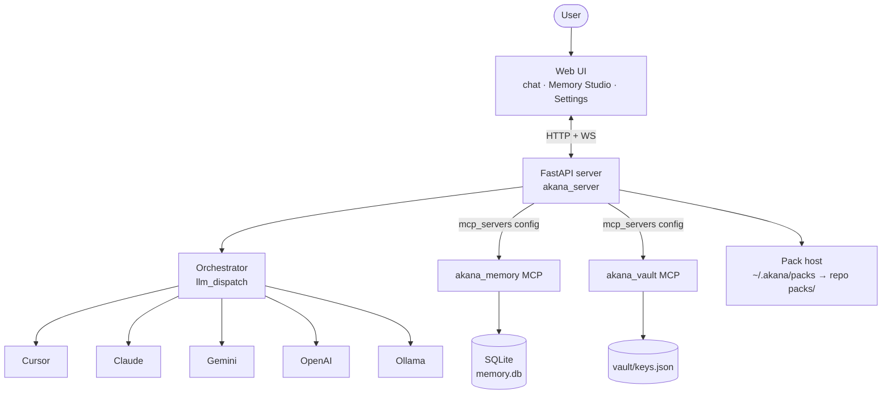

# Architecture

A short map of how Akana is put together: the server, the orchestrator, the memory/vault MCP servers and the pack host. For the one-paragraph version, see [How it works](../README.md#how-it-works) in the README.



## Server

The core is a FastAPI application (`akana_server/`) that serves both HTTP and WebSocket surfaces from the same port. HTTP handles the REST surfaces and the SSE chat stream: chat submission, memory CRUD, vault edit/reveal, packs, settings, plus the wake/STT/TTS endpoints. WebSockets carry the live event feed (`/ws/events`) and, optionally, the Gemini Live and OpenAI Realtime bridges.

Static assets under `web_ui/` are served by the same server: chat (`index.html`), Memory Studio (`memory.html`) and the Settings tab all live there as plain HTML/JS with **no build step**.

The server binds to `127.0.0.1:8766` by default.

## Orchestrator

Between the HTTP surface and the providers sits the orchestrator (`akana_server/orchestrator/`). A single dispatch hub, `llm_dispatch.py`, resolves the configured provider name to a `ChatProvider` implementation and forwards each turn. The four module providers (Claude, Gemini, OpenAI, Ollama) satisfy the same base interface (`akana_server/orchestrator/base.py`) and dispatch through a registry, so adding one of these is one registry entry plus a module implementing that interface. Cursor is the built-in dispatch tail with its own daemon-vs-direct routing.

The orchestrator also owns the tool surface:

- For MCP-speaking providers (Cursor, Claude) it composes an `mcp_servers` payload delivered through the CLI/SDK.
- For the function-calling providers (Gemini, OpenAI, Ollama) it re-declares the same memory and vault tools as native schemas and reaches external MCP servers via an in-process bridge (`mcp_bridge.py`) that surfaces them as `mcp__<server>__<tool>` functions.

See [docs/providers.md](providers.md) for the per-provider details.

## Memory and vault as MCP servers

Memory and vault are exposed as first-party stdio MCP servers (`scripts/mcp_memory.py`, `scripts/mcp_vault.py`) that MCP-speaking provider CLIs (Cursor, Claude) spawn per turn, so the same servers can be attached to external MCP clients as well. Function-calling providers (Gemini, OpenAI, Ollama) get the same tools in-process instead, with no subprocess.

- Memory model and pipeline: [docs/memory.md](memory.md).
- Vault details are below.

## Pack host

Packs are discovered from `~/.akana/packs` (user-installed) and the repo's `packs/` directory, in that order. Enabling a pack only registers its skills and persona; mounting the pack's MCP server into `mcp_servers.yaml` is a separate, bearer-authenticated step (`POST /packs/consent`). See the [Packs section](../README.md#capability-packs) in the README.

## Vault

The vault is a per-user, Fernet-encrypted store (AES-128-CBC + HMAC-SHA256) for provider keys and other credentials. Ciphertext is tagged with a `vault1:` prefix so legacy plaintext blobs can be detected and migrated.

The master key lives **outside** the data directory. Resolution order:

1. `AKANA_VAULT_KEY` environment variable (the key material itself).
2. `AKANA_VAULT_KEYFILE` environment variable (a path).
3. OS keyring, when `AKANA_VAULT_KEYRING=1`.
4. A default keyfile generated on first use at:
   - Linux / macOS: `$XDG_CONFIG_HOME/akana/vault.key` (falls back to `~/.config/akana/vault.key`)
   - Windows: `%APPDATA%\akana\vault.key` (upgraders: an existing `~/.config/akana/vault.key` is kept in place so the key is not regenerated).

The default keyfile and its parent directory are written owner-only (0600 file, 0700 directory on POSIX; on Windows the code additionally calls `icacls` to strip inheritance and grant only the current user) using an atomic tmp-then-rename.

Two storage partitions live under the data directory:

- `secrets.json` — allowlisted system credentials (`cursor_api_key`, `claude_oauth_token`, `gemini_api_key`, `openai_api_key`, `telegram_bot_token`).
- `vault/keys.json` and `credentials/<namespace>/<profile>/secrets.enc` — every other scalar or per-service credential bundle.

The namespace/profile layout lets the vault hold multiple credential sets for the same service side by side: one namespace per service, one profile per environment or account, each profile in its own encrypted bundle.

Credentials are edited through a bearer-authenticated REST surface (Settings in the web UI). Listings are masked (`{set, hint}`); a per-key reveal endpoint returns the plaintext. Each read, write, delete and reveal is written to an audit log so the assistant's use of vault tools is auditable after the fact.

To rotate the master key: decrypt every entry with the old key, replace the keyfile (or update `AKANA_VAULT_KEY`), then re-encrypt. The `assert_writable` check prevents any accidental rotation-without-decrypt: if the on-disk blob does not decrypt with the current key, writes refuse to proceed until the mismatch is resolved.

The assistant also has in-process vault tools (`vault_list`, `vault_get`, `vault_set`, `vault_delete`, plus credential variants). **These tools are not permission-gated at call time:** the model can read or mutate any secret; every access is written to an audit log. Set `AKANA_VAULT_TOOLS=0` to disable them.

### When encryption fails

The crypto layer is intentionally **fail-closed on write**:

- If `cryptography` is unimportable, the layer degrades to passthrough so the app still boots, but `encrypt_str` raises `RuntimeError` — no plaintext is persisted.
- If the master key is corrupt or missing, `encrypt_str` raises before touching disk.
- If the on-disk blob is encrypted-but-undecryptable (wrong master key), writes refuse to proceed via `assert_writable` / `VaultUndecryptableError`. A wrong master key cannot destroy real secrets by overwriting them with an empty base.

## Data directory layout

Default `AKANA_DATA_DIR` is `~/.akana`.

```
~/.akana/
├── db/
│   └── memory.db              # episodic turns + semantic facts
├── llm_settings.json          # per-provider model selections
├── runtime_settings.json      # live-editable runtime config
├── memory_settings.yaml       # inbox/capture/vector toggles
├── voice_preferences.json     # picked TTS engine + per-lang voice
├── voices/                    # piper .onnx files, xtts_ref.wav
├── secrets.json               # allowlisted system provider keys
├── vault/
│   └── keys.json              # encrypted scalar vault
├── credentials/               # per-namespace/profile encrypted bundles
├── skills/                    # installed skill directories
├── packs/                     # user-installed packs (discovered before repo/packs)
└── logs/
    └── server.log
```

The master vault key is deliberately outside this tree (see [Vault](#vault) above).
